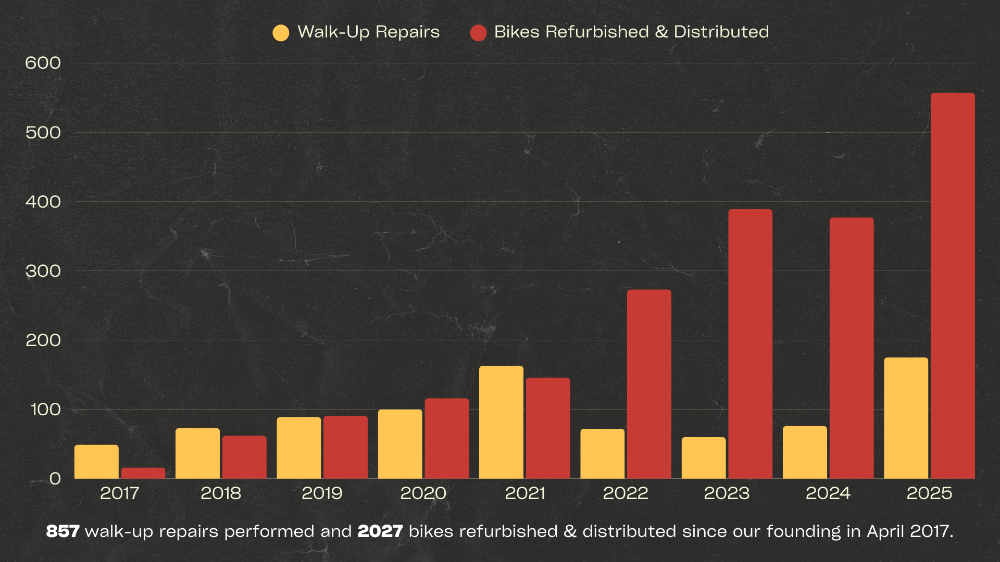
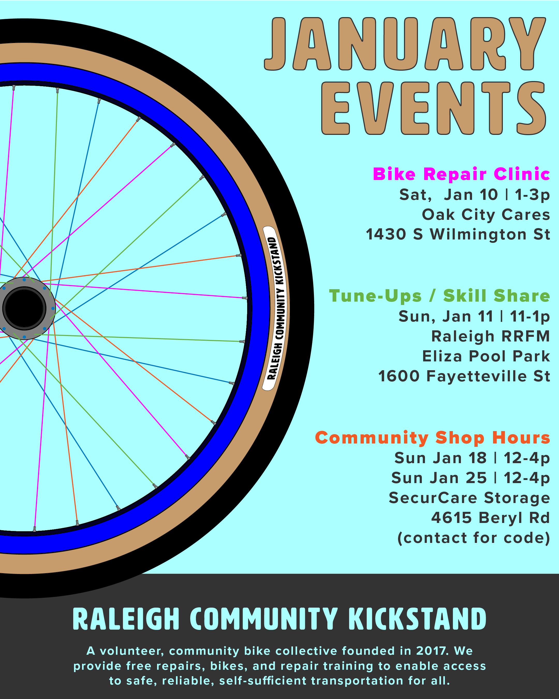

# January 2026 Newsletter

## December Summary

In December, we hosted a free bike repair and distribution clinic and two community shop hour sessions. We completed 5 walk-up repairs during those events. Our adopt-a-bike and event volunteers refurbished 52 donated bikes for our neighbors facing housing and transportation barriers. We distributed 31 bikes at our second Saturday event at Oak City Cares and 21 through our partner organizations including Fernandez Community Center, South Wilmington Street Men’s Shelter, Raleigh Rescue Mission, Step Up Ministry, and Healing Transitions.

The numbers only tell part of the story. They miss how people show up for each other in small, tangible ways. In September, a new volunteer came to help fix bikes. While working together, he shared that he had recently come out of a tough situation and was trying to rebuild while still finding ways to support others. He spent the afternoon turning wrenches with us, then was headed to Durham to help serve meals at a church. Getting around was hard without a bike, so one of the bikes he repaired became his. In December, he rolled back by an event. He said he was saving up for an e-bike, so he tuned up his bike and handed it off to someone else. It’s a small moment, but an example of what we are trying to build and how access moves through the community.

## 2025 Summary

In 2025, we hosted 59 events including 27 pop-up repair events, 29 shop hour sessions, and 3 free maintenance workshops. We repaired 732 bikes, including 175 free walk-up repairs at our events and 557 bikes refurbished and distributed for free to folks in need through our events and partner organizations. This work has grown steadily each year, reflecting the sustained demand for reliable, self-sufficient transportation and our commitment to expand our capacity to meet it.

Take a moment to let that sink in. Those numbers are staggering. It’s hard to wrap your head around how a few dozen volunteers repaired 732 bikes. That’s more than most bike shops see in a year. All done for free by a small group of volunteers working as a collective, showing up month after month to share skills and fix bikes one at a time. It’s truly hard to imagine until you see the pile of donated bikes.

Thanks to everyone who showed up this year to repair bikes, share skills, and support the work behind the scenes. This work only happens because people show up for each other. See you in 2026\!

## January Events

Flyer by Michael D'Argenio

**Bike Repair & Distribution \- Volunteers needed\!**  
Where: Oak City Cares \- 1430 S Wilmington Street  
When: Saturday, January 10 | 1-3p  
We repair and distribute bikes on a first-come, first-served basis the 2nd Saturday of each month at Oak City Cares, a multiservice center for folks experiencing housing insecurity. Please fill out the sheet below letting us know you are coming and how you’d like to help with the event.  
[https://docs.google.com/spreadsheets/d/1VJGkxpowGLi9LNfFjneI8mNoEKFTLBa6J27K8PHTpyE/edit?gid=302512647\#gid=302512647](https://docs.google.com/spreadsheets/d/1VJGkxpowGLi9LNfFjneI8mNoEKFTLBa6J27K8PHTpyE/edit?gid=302512647#gid=302512647)

**Kickstand Annual Volunteer Party \- Come socialize\!**  
Where: Bend Bar (853 W Morgan St)  
When: Saturday, January 10 | 4-7pm  
You are cordially invited to the annual Kickstand party. Come celebrate and socialize\! Roll up after the second Saturday repair event and bring your significant others. We will get pizzas from Trophy on the company dime around 5\. You are welcome to snag drinks and/or other snacks from Bend Bar. Hope to see you there\!

**Community Shop Hours**  
Where: SecurCare Storage \- 4615 Beryl Rd  
When: Sunday, January 18 12-4p & Sunday, January 25 12-4p  
Our open shop hours at our storage space. Folks can come use our tools to learn about bike repair, work on their bike, and/or work on a bike for distribution. Contact me if you're coming in advance to coordinate gate access.

**Basic Tune-Ups & Skill Share**  
Where: Raleigh Really, Really Free Market @ Eliza Pool Park \- 1600 Fayetteville St  
When: Sunday, January 11 | 11-1p  
A pop-up repair clinic at the Raleigh Really, Really Free Market where we will be performing basic adjustments and safety checks with a paired down tool set. We also do a basic maintenance skill share covering fix-a-flat, chain maintenance, and more if folks want. Let me know if you’re interested in helping out\!

**Oaks & Spokes Member Party**  
Where: Transfer Co Ballroom \- 500 E Davie St, Suite 160  
When: Friday, January 23 | 5:30-8:30p  
Annual member party for Oaks & Spokes. It's a festive vibe with drinks and mingling. There are also some updates delivered about the previous year and looking forward to the new year. We will also provide an update about RCK. O\&S is our fiscal sponsor and supports us through grants and direct funding.
