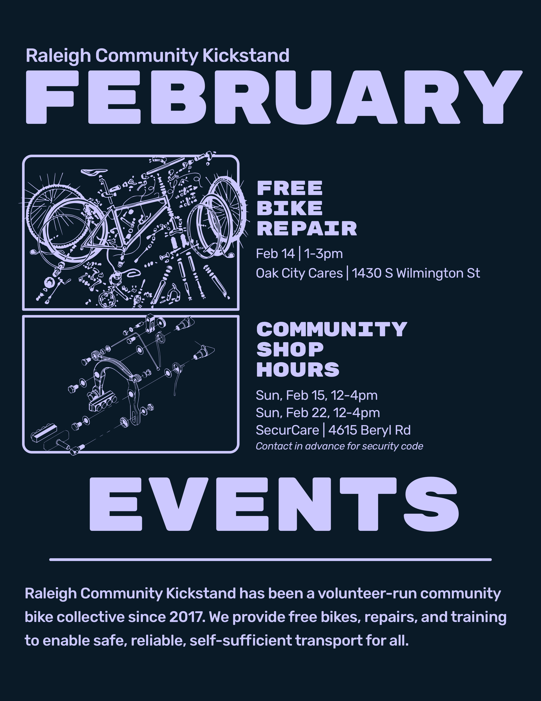

# February 2026 Newsletter

## January Summary

2026 was off to a cold but busy start. Despite the two winter storms that came through, it was our biggest month yet\! We repaired 93 bikes (and 1 Toyota Tacoma\!) through 12 walk-up repairs and 81 refurbished bikes distributed to neighbors in need of reliable, self-sufficient transportation.

We held our second Saturday monthly repair event at Oak City Cares, performed tune-ups and shared basic maintenance skills at the Raleigh Really Really Free Market, and hosted community shop hour sessions. 30 bikes were distributed through Oak City Cares, 25 bikes through our monthly deliveries to partner organizations, including Feed the Pack Pantry, Haven House, Raleigh Rescue Mission, Healing Transitions, and Cornerstone Center. We also placed 12 bikes through a new partnership with Kirk of Kildaire Presbyterian Church and 14 bikes through direct placement and mutual aid efforts.

One of our founders had the opportunity to teach two different two-week bike repair classes at a high school. They worked through a truckload of Kickstand bikes, stripping and recycling 19 bikes for parts and refurbishing 32 bikes to give away. They learned everything from basic brake adjustments tune-ups to packing hubs, but most importantly got the experience of riding around Durham on bikes they built themselves, including a couple of kangaroo bikes.

We also had the chance to report on our many successes this last year at our annual Kickstand volunteer party and the Oaks and Spokes member party. All in all, it was a great month. Thanks to everyone who showed up, hauled stuff, wrenched, taught, and made this work happen. This only works because people keep showing up for each other. See you in February\!

## February Events

Flyer by Jeff Wilkinson

**Bike Repair & Distribution \- Volunteers needed\!**  
Where: Oak City Cares \- 1430 S Wilmington Street  
When: Saturday, February 14 | 1-3p  
We repair and distribute bikes on a first-come, first-served basis the 2nd Saturday of each month at Oak City Cares, a multiservice center for folks experiencing housing insecurity. Please fill out the sheet below letting us know you are coming and how you’d like to help with the event.  
[https://docs.google.com/spreadsheets/d/1VJGkxpowGLi9LNfFjneI8mNoEKFTLBa6J27K8PHTpyE/edit?gid=302512647\#gid=302512647](https://docs.google.com/spreadsheets/d/1VJGkxpowGLi9LNfFjneI8mNoEKFTLBa6J27K8PHTpyE/edit?gid=302512647#gid=302512647)

**Community Shop Hours**  
Where: SecurCare Storage \- 4615 Beryl Rd  
When: Sunday, February 15 12-4p & Sunday, February 22 12-4p  
Our open shop hours at our storage space. Folks can come use our tools to learn about bike repair, work on their bike, and/or work on a bike for distribution. Contact me if you're coming in advance to coordinate gate access.
