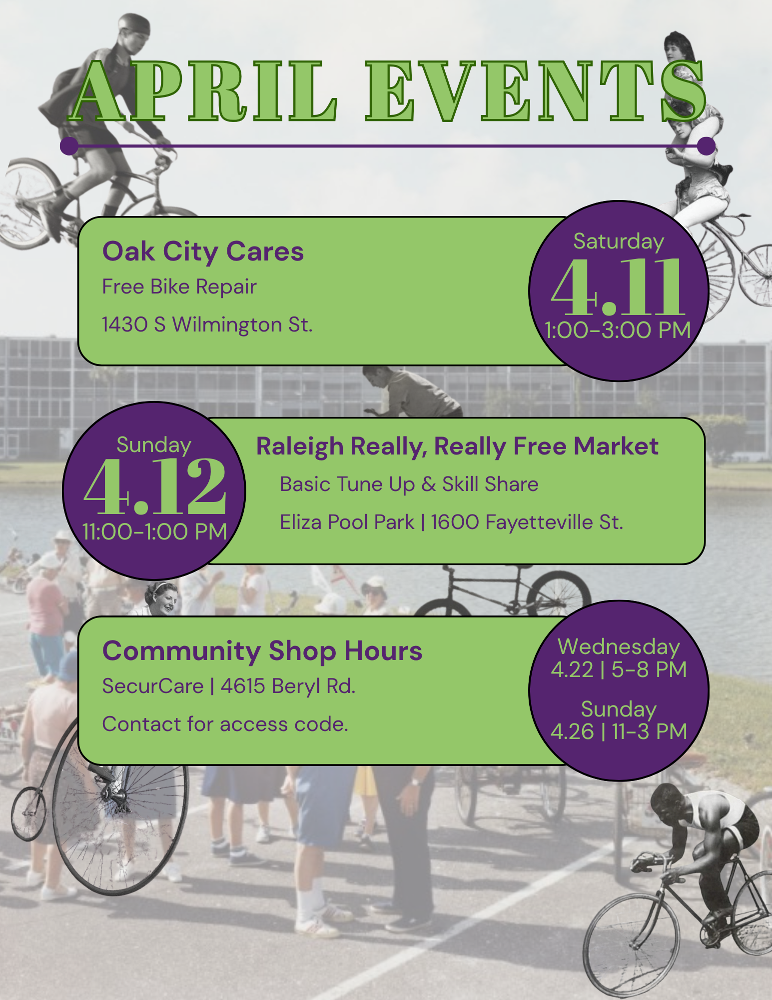

# April 2026 Newsletter

## March Summary

We’ll start this month's summary with a haiku:

```
spring’s started to sprung
the pollen is in my lungs
but the weather’s nice
```

We’ve officially hit the equinox and the start of daylight savings time. The weather is getting nicer, and we have light until almost 8pm. There’s been a big uptick in both volunteers and folks seeking services, as we all emerge from hibernation and want to get back out on the bike. We tuned up 31 bikes in total this month across 5 different events, including 17(\!) at Peach Road Community Center with Oaks & Spokes, 6 at Oak City Cares, and 8 at community shop hours.

In addition to the walk-up repairs, we refurbished and distributed 34 bikes to folks experiencing housing insecurity. We placed 5 through our second Saturday event at Oak City Cares, 4 through Peach Road Community Center, 5 through direct mutual aid, and 20 through our deliveries with the TAM Food Pantry truck. Our delivery route this month included partner organizations Feed the Pack Pantry, Raleigh Rescue Mission, Healing Transitions, and Kirk of Kildaire Church. Please reach out if you know other orgs or aid groups we could partner with to get refurbished bikes to folks in our community who wouldn’t otherwise have a means to get around.

Thanks so much to everyone who makes this work possible. Hope to see you out at an event this month. Remember, anyone and everyone is always welcome\! No experience necessary. There are many ways to get involved that don’t involve turning wrenches, and you can always learn by doing\!

## April Events



Flyer by Eva Bowe

**Bike Repair & Distribution \- Volunteers needed\!**  
Where: Oak City Cares \- 1430 S Wilmington Street  
When: Saturday, April 11 | 1-3p  
We repair and distribute bikes on a first-come, first-served basis the 2nd Saturday of each month at Oak City Cares, a multiservice center for folks experiencing housing insecurity. I bring 4 sets of tools / stands, but we often have more volunteers than stations, so feel free to bring your own tools and/or stands. Please fill out the sheet below letting us know you are coming and how you’d like to help with the event.  
[https://docs.google.com/spreadsheets/d/1VJGkxpowGLi9LNfFjneI8mNoEKFTLBa6J27K8PHTpyE/edit?gid=302512647\#gid=302512647](https://docs.google.com/spreadsheets/d/1VJGkxpowGLi9LNfFjneI8mNoEKFTLBa6J27K8PHTpyE/edit?gid=302512647#gid=302512647)

**Basic Tune-Ups & Skill Share \- Volunteer needed\!**  
Where: Raleigh Really, Really Free Market @ Eliza Pool Park \- 1600 Fayetteville St  
When: Sunday, April 12 | 11-1p  
A pop-up repair clinic at the Raleigh Really, Really Free Market where we will be performing basic adjustments and safety checks with a paired down tool set. We also do a basic maintenance skill share covering fix-a-flat, chain maintenance, and more if folks want. I could use at least one other set of hands. Reach out if you can help\!

**Community Shop Hours**  
Where: SecurCare Storage \- 4615 Beryl Rd  
When: Wednesday, April 22 5-8p | Sunday, April 26 11-3p  
Our open shop hours at our storage space. Folks can come use our tools to learn about bike repair, work on their bike, and/or work on a bike for distribution. It’s a great time to work on bikes in good company. Contact me if you're coming in advance so I can send you the gate access info.
