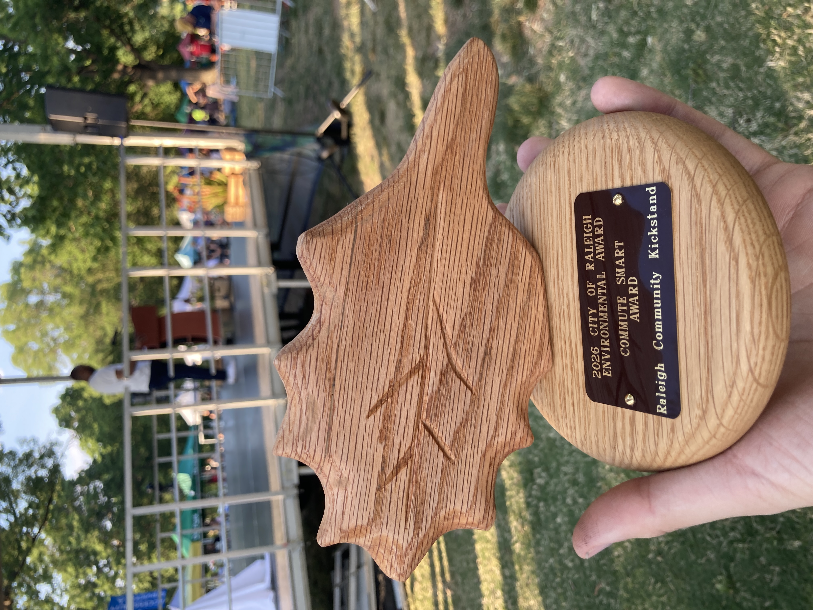

# May 2026 Newsletter

## Monthly Dispatch

Happy bike month to all those who celebrate\! We are privileged to have such a vibrant bike community that there is an almost overwhelming amount of opportunities to get on your bike in different ways with good people. Check out [Bike Month Raleigh](https://bikemonthraleigh.org/) to see everything happening this month. (I will shamelessly plug that I made the website if it gets you to click through and check something out something cool this month.)

As for Kickstand happenings this last month, we hosted a couple shop hour sessions, our monthly second Saturday Oak City Cares repair event, and a pop-up at the Raleigh Really, Really Free Market. We performed 12 walk-up repairs and refurbished and gave away 12 donated bikes at these events. Adopt-a-bike program mechanics have been busy fixing up bikes to prepare for more deliveries to our partner organizations this month. We also won the Commute Smart Award as part of the City of Raleigh’s 2026 Environmental Awards\! Almost unbelievably, this is our second time winning this award in its four years of existence. Let me know if you want to arrange a sleepover with the oak leaf trophy to impress your dinner party guests.

We also hosted a large meeting of the minds this past month to reflect on how things have been going and where we want things to go in the future. There are some big ideas, but we need help to make them happen. Which begs the question: who is Community Kickstand? You are\! Everyone reading this email, everyone who has ever showed up to an event or donated a bike or slapped a Kickstand sticker on a bottle or a street sign. You are all Kickstand\! You can all help out in any capacity. There are so many ways to get involved for everyone that aren’t just turning wrenches. Here are the biggest ways you can help out right now:

For folks who want to turn a wrench or learn how to turn a wrench:

- Show up to an event, particularly on May 17th
- Become a shop hour volunteer or even a shop hour manager
- Join the adopt-a-bike program
- Host other repair events

For folks who have no interest in wrenching or learning to wrench:

- Identify more orgs and collectives working with folks in need of reliable, self-sufficient transportation
- Help us outfit the containers (anybody know any solar energy connections?)
- Help us identify grants and other funding sources to keep this thing moving
- Plan and coordinate other events (maybe even fun social events?)

That’s all for now. Hope to see you out there at an event this bike month\!

## May (Bike Month) Events

<!--  -->

Flyer by Kylie Robinsun

**Bike Month Raleigh Kickoff**  
Where: The Bend Bar \- 853 W Morgan St  
When: Saturday, May 2nd @ 4-7pm  
Celebrate the start of Bike Month with a casual social headed up by Oaks & Spokes. Be sure to pick up your Bike Month passport, grab a slice of pizza, and pick up some free swag\! This is a drop-in event, so swing by anytime\!

**Bike Repair & Distribution \- volunteers needed\!**  
Where: Oak City Cares \- 1430 S Wilmington Street  
When: Saturday, May 9 | 1-3p  
We repair and distribute bikes on a first-come, first-served basis the 2nd Saturday of each month at Oak City Cares, a multiservice center for folks experiencing housing insecurity. I bring 4 sets of tools / stands, but we often have more volunteers than stations, so feel free to bring your own tools and/or stands. Please fill out the sheet below letting us know you are coming and how you’d like to help with the event.  
[https://docs.google.com/spreadsheets/d/1VJGkxpowGLi9LNfFjneI8mNoEKFTLBa6J27K8PHTpyE/edit?gid=302512647\#gid=302512647](https://docs.google.com/spreadsheets/d/1VJGkxpowGLi9LNfFjneI8mNoEKFTLBa6J27K8PHTpyE/edit?gid=302512647#gid=302512647)

**Volunteer Work Session: Container Clean-Out \- volunteers needed\!**  
Where: Gravel Lot off Hunt Drive at Dix Park | 35.774059, \-78.660315  
When: Sunday, May 17 | 10-2p  
Did you know that Oaks & Spokes / RCK was gifted a shipping container full of bikes from Trips for Kids RDU? Our new (old) container is now living at Dix Park and needs some TLC\! Come help clean out the container and learn about bike repair as we tune up kids' bikes to give away. Snacks and bevs provided. Meet in the gravel lot off the Dix Park entrance at Hunt Dr. Near "Sunflower Field \#1" or 35.774059, \-78.660315. Need help with coordination and volunteers day of, so please fill out the sheet if you can help out.  
[https://docs.google.com/spreadsheets/d/1VJGkxpowGLi9LNfFjneI8mNoEKFTLBa6J27K8PHTpyE/edit?gid=337949020\#gid=337949020](https://docs.google.com/spreadsheets/d/1VJGkxpowGLi9LNfFjneI8mNoEKFTLBa6J27K8PHTpyE/edit?gid=337949020#gid=337949020)

**Community Shop Hours \- everyone welcome\!**  
Where: SecurCare Storage \- 4615 Beryl Rd  
When: Thursday, May 7 5-8p | Sunday, May 24 11-3p  
Our open shop hours at our storage space. Folks can come use our tools to learn about bike repair, work on their bike, and/or work on a bike for distribution. It’s a great time to work on bikes in good company. Contact me if you're coming in advance so I can send you the gate access info.
