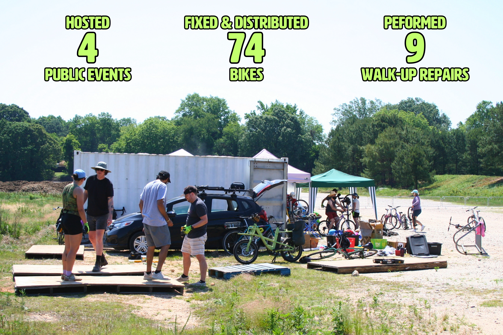
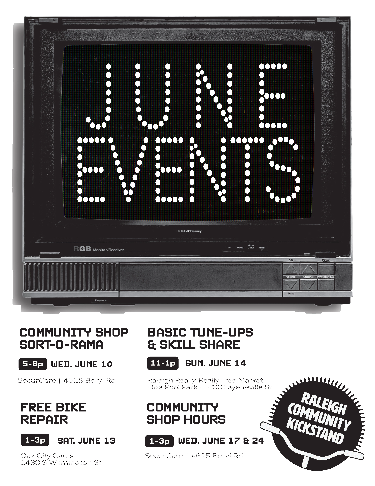

# June 2026 Newsletter

## Monthly Dispatch

Bike Month was a lot of fun and a huge success\! So many great events and orgs/businesses coming together to support and celebrate life on two wheels. It was amazing to see so many new faces helping out, particularly at the container clean-out event. Shout out to Oaks & Spokes and Jared for having the vision to coordinate and compile all the events together. Turns out passport books and stamps are a huge motivator\!

This month, we hosted 4 events, performed 9 walk-up repairs, and refurbished another 74 bikes that were distributed directly to folks in need of reliable transportation. At our two community shop hours sessions, we fixed up some bikes for distribution and taught some bike repair. We performed walk-up repairs and distributed 19 bikes at our monthly second Saturday event at Oak City Cares. We also coordinated deliveries and pick-ups with our partner organizations to distribute 55 bikes through Haven House, Healing Transitions, Cornerstone Center, Kirk of Kildaire, and Neuse River Middle School.

Over 30 volunteers showed up to our first event at the new shipping container (Larry the container and now Sherri the other container) at Dix Park\! I am still blown away by how much we were able to get done, especially with how hot it was. We successfully cleaned out and organized the container, built a porch to hang out on, and fixed up the 29 kids’ bikes in the container from Trips for Kids. It was such a great crew of folks helping out and walking around to make sure everyone was hydrated, sunscreened, and took their union-mandated popsicle break.

There’s a lot of excitement around these containers. They provide a great opportunity for some future Oaks & Spokes and Community Kickstand programming. However, we still need some help to make this happen, so I am putting out the call for help in setting up solar power for fans / lights, installing some sort of roll-up canopies for shade, and continuing to build out storage and work space in the containers to make them usable. Please contact [volunteer@raleighcommunitykickstand.org](mailto:volunteer@raleighcommunitykickstand.org) if you are interested in helping out in any way whether that installing or trying to contact folks who could donate things or help out.

Hope to see you out there in June and let’s go canes\!

## June Events

Flyer by Maggie Lytle

**Bike Repair & Distribution \- volunteers needed\!**  
Where: Oak City Cares \- 1430 S Wilmington Street  
When: Saturday, June 13 | 1-3p  
We repair and distribute bikes on a first-come, first-served basis the 2nd Saturday of each month at Oak City Cares, a multiservice center for folks experiencing housing insecurity. I bring 4 sets of tools / stands, but we often have more volunteers than stations, so feel free to bring your own tools and/or stands. Please fill out the sheet below letting us know you are coming and how you’d like to help with the event.  
[https://docs.google.com/spreadsheets/d/1VJGkxpowGLi9LNfFjneI8mNoEKFTLBa6J27K8PHTpyE/edit?gid=302512647\#gid=302512647](https://docs.google.com/spreadsheets/d/1VJGkxpowGLi9LNfFjneI8mNoEKFTLBa6J27K8PHTpyE/edit?gid=302512647#gid=302512647)

**Basic Tune-Ups & Skill Share \- volunteer needed\!**  
Where: Raleigh Really, Really Free Market @ Eliza Pool Park \- 1600 Fayetteville St  
When: Sunday, June 14 | 11-1p  
A pop-up repair clinic at the Raleigh Really, Really Free Market where we will be performing basic adjustments and safety checks with a paired down tool set. We also do a basic maintenance skill share covering fix-a-flat, chain maintenance, and more if folks want. I could use at least one other set of hands. Contact [volunteer@raleighcommunitykickstand.org](mailto:volunteer@raleighcommunitykickstand.org) if you can help\!

**Community Shop Sort-o-rama \- volunteers needed\!**  
Where: SecurCare Storage \- 4615 Beryl Rd  
When: Wednesday, June 10 | 5-8p  
We've built up quite an inventory of parts in our community shop space in the last year and a half. Come help us organize components and kit up bins for our pop-up repair events. Come for the snacks, stay for the weirdo parts. Contact [volunteer@raleighcommunitykickstand.org](mailto:volunteer@raleighcommunitykickstand.org) in advance for the gate access info.

**Community Shop Hours \- everyone welcome\!**  
Where: SecurCare Storage \- 4615 Beryl Rd  
When: Wednesdays, June 17 & 24 5-8p  
Our open shop hours at our storage space. Folks can come use our tools to learn about bike repair, work on their bike, and/or work on a bike for distribution. It’s a great time to work on bikes in good company. Contact [volunteer@raleighcommunitykickstand.org](mailto:volunteer@raleighcommunitykickstand.org) in advance for the gate access info.
