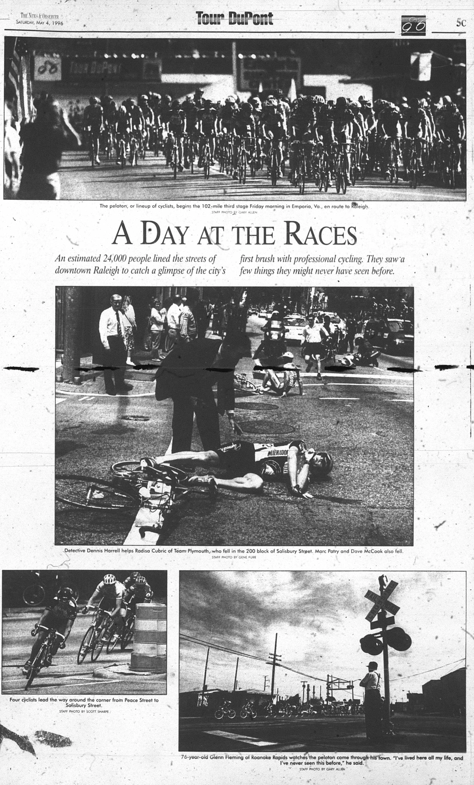
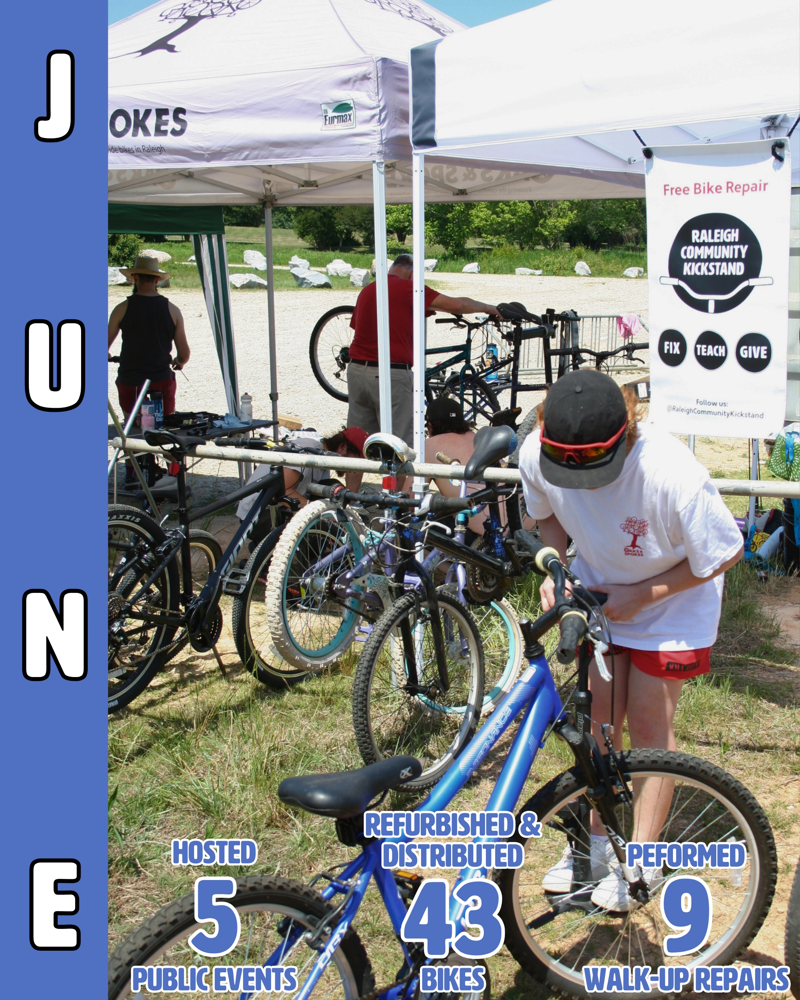
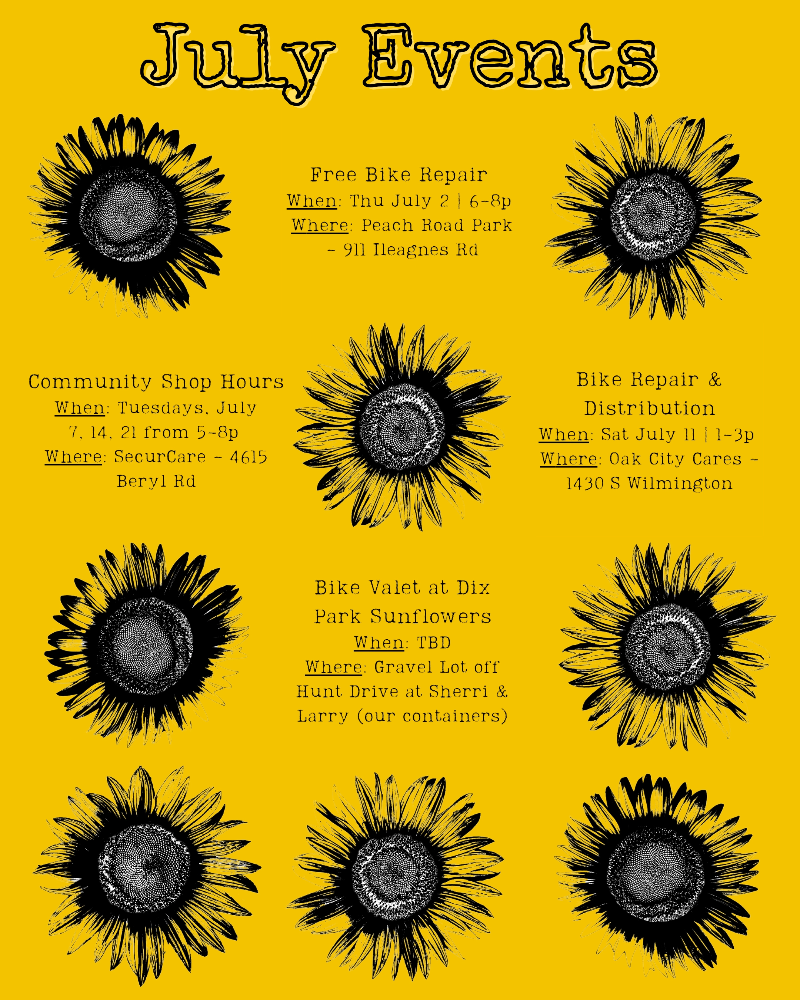

# July 2026 Newsletter

## Monthly Dispatch

Welp, the Canes did it. They brought the Stanley Cup back home to Raleigh. And while Rod won’t respond to my emails asking about bringing the trophy to shop hours, Brian unearthed [this other sports gem of the time a major cycling stage race came to Raleigh](https://www.youtube.com/watch?v=B38FKZtK5ww&t=1181s) featuring internationally renowned cyclists and a pre-doping (?) Lance Armstrong. While this race pre-dated my time in NC by 8 years, it was very cool to see the pros ride down the same streets I ride every day\!

Speaking of pro cycling, the Tour de France kicks off on July 4th followed by the Tour de Femmes on August 1st. I figured it would be fun to do a Kickstand friends & family fantasy league. You don’t need to know anything about pro cycling to join, just pick a team of riders based on whatever metric you want (most fun names, only youngins’, only Belgians). Even if you don’t know much (like me), you’re still liable to win because the tour is long and chaotic. Info to join is below.

In more Kickstand related news, we hosted three shop hours sessions where we did some long overdue spring-cleaning, taught some folks how to repair their bikes, and tuned up a lot of good bikes to give away. At Oak City Cares, our volunteers braved the heat to tune up and distribute 9 bikes while also performing 5 walk-up repairs including our first rollator. We also tuned up a couple bikes and taught a few folks some tips on bike repair at the Raleigh Really, Really Free Market.

Our adopt-a-bike mechanics were busy tuning up bikes to distribute to our partner organizations. We delivered 17 refurbished bikes to Raleigh Rescue Mission, Feed the Pack Pantry, Healing Transitions, SWS Men’s Shelter, Raleigh’s Housing and Community Development, Cornerstone Center, and Fernandez Community Center. Southeast Raleigh Promise also came by our shipping containers at Dix Park to pick up the remaining 17 kids’ bikes that were tuned up last month.

Last, but certainly not least, I am happy to announce our second Melted Crayon Benefit Alleycat & Cookout is happening on August 8th\! Does doing it two years in a row make it annual? All the info is below, but basically, think of this as our corporate summer cookout, featuring a fun scavenger hunt on bikes. Hope to see you there\!

## July Events

Flyer by jazzybageldesign

**Bike Repair with Oaks & Spokes \- volunteers needed\!**  
When: Thursday, July 2 | 6-8p  
Where: Peach Road Park \- 911 Ileagnes Rd  
Pop-up free bike repair event with Oaks & Spokes. This event is targeted towards adults, but the neighborhood kids come by for some help and to help out as well. We will have some tools and stands, but feel free to bring your own if you’d prefer. The community center will be broadcasting some World Cup games and hosting an early 4th of July celebration. Please fill out the sheet below letting us know you are coming and how you’d like to help with the event.  
[https://docs.google.com/spreadsheets/d/1VJGkxpowGLi9LNfFjneI8mNoEKFTLBa6J27K8PHTpyE/edit?gid=712399713\#gid=712399713](https://docs.google.com/spreadsheets/d/1VJGkxpowGLi9LNfFjneI8mNoEKFTLBa6J27K8PHTpyE/edit?gid=712399713#gid=712399713)

**Community Shop Hours \- everyone welcome\!**  
When: Tuesdays, July 7, 14, 21 | 5-8p  
Where: SecurCare Storage \- 4615 Beryl Rd  
Our open shop hours at our storage space. Folks can come use our tools to learn about bike repair, work on their bike, and/or work on bikes for distribution. It’s a great time working with good company. Contact [volunteer@raleighcommunitykickstand.org](mailto:volunteer@raleighcommunitykickstand.org) in advance for the gate access info.

**Bike Repair & Distribution \- volunteers needed\!**  
When: Saturday, July 11 | 1-3p  
Where: Oak City Cares \- 1430 S Wilmington Street  
We repair and distribute bikes on a first-come, first-served basis the 2nd Saturday of each month at Oak City Cares, a multiservice center for folks experiencing housing insecurity. We will have some tools and stands, but we often have more volunteers than stations, so feel free to bring your own. Please fill out the sheet below letting us know you are coming and how you’d like to help with the event.  
[https://docs.google.com/spreadsheets/d/1VJGkxpowGLi9LNfFjneI8mNoEKFTLBa6J27K8PHTpyE/edit?gid=302512647\#gid=302512647](https://docs.google.com/spreadsheets/d/1VJGkxpowGLi9LNfFjneI8mNoEKFTLBa6J27K8PHTpyE/edit?gid=302512647#gid=302512647)

**Bike Valet at Dix Park Sunflowers \- come hang\!**  
When: TBD \- working with Dix to figure out dates  
Where: Gravel Lot off Hunt Drive at Dix Park | 35.774059, \-78.660315  
Our new shipping containers, Sherri and Larry, are located right next to the Dix Park Sunflower Field\! Come hang out with us at the new containers as we provide bike valet service, provide safety checks, and get the word out about Oaks & Spokes and Raleigh Community Kickstand.

## Save The Date\!

**Melted Crayon Benefit Alleycat & Cookout**  
Join us for our second annual alleycat & cookout\! Alleycats are fun, choose-your-own-adventure rides inspired by bike couriers. You’ll get a list of stops, plan a route, and hit as many stops as you can (or want to) before the cutoff. Each stop earns you a random crayon. At the end, use them to color in a drawing. Best ones win prizes\!

Ride solo or party-pace with a group. Perfect for beginners, newcomers, veteran townies, and everyone in between. Featuring a post-ride cookout with hot dogs (veggie and meat), drinks, and snacks. Proceeds go to us\! $10 Suggested Donation. Think of it as our summer corporate gathering. Hope to see you there\!

Where: Jaycee Park Picnic Shelter | 2405 Wade Ave  
When: Saturday, August 8 | Registration: 5pm | Start: 6pm | Cutoff \+ Cookout: 8pm

## Join Our Fantasy League

Join the Kickstand Tour de France and Tour de Femmes fantasy league. You don’t need to know anything about pro-cycling (like me) to join. You can just pick a team, learn as you go, and see what happens. The winner will win a 1 of 1 sticker that says, “I am the best at selecting an arbitrary group of riders to do well in the Tour de France 2026 out of all the volunteer Raleigh bike mechanics” printed in black and white on a 4x6” UPS label. There will be a similar one awarded for the Tour de Femmes.

Go to the link below. Click “Enter now” and create an account. Choose your team then join with our league code. Deadline is 10am on July 4th\! Pro-tip: write down your picks so if you need more time or if it doesn’t go through, you don’t have to start all over. Here are the [rules](https://www.velogames.com/velogame/2026/rules.php) and [scoring system](https://www.velogames.com/velogame/2026/scores.php). The rules can feel overwhelming at first. You can either read them or just do what I do and ignore them and pick a random team of 9 riders. The scoring will make sense as the tour goes on. See you at Velogames 2026\!

Sign-Up: [https://www.velogames.com/velogame/2026/](https://www.velogames.com/velogame/2026/)  
League Name: Community Kickstand & Company  
League Code: 686569629  
Deadline: July 4 @ 10am  
Tour de Femmes Deadline: August 1 (link won’t go live until closer to the date)
