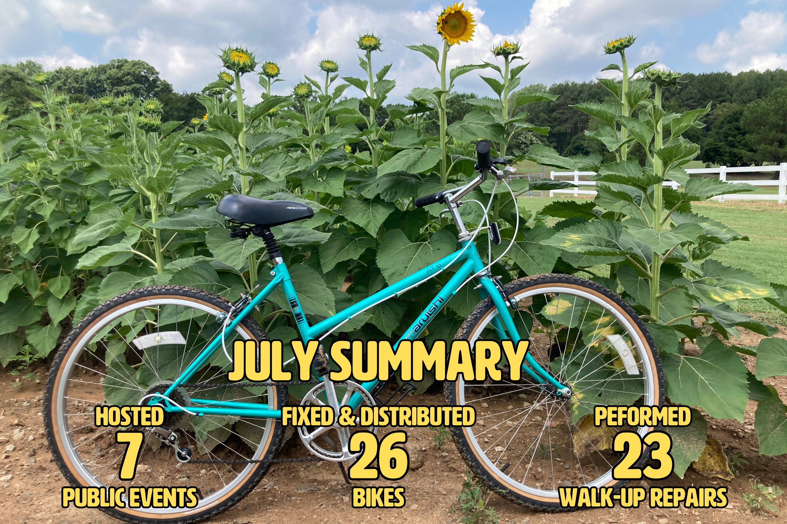
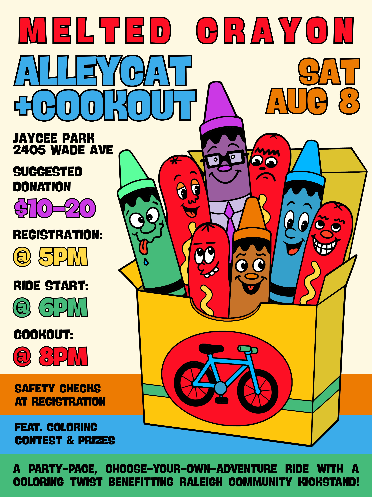
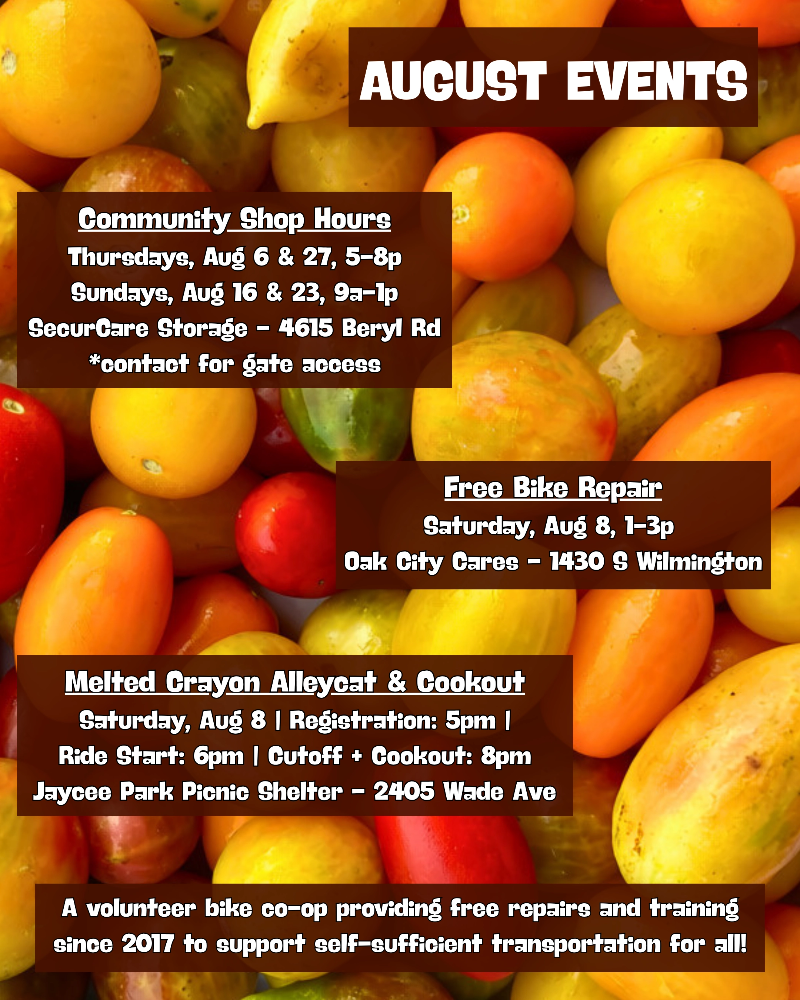

# August 2026 Newsletter

## Monthly Dispatch

July was a hot one, but a fun one! It started with a repair event at Peach Road Park where we watched a World Cup match on the city’s big screen with the neighbors and tuned up some bikes. From there, we hosted our first events at the containers (affectionately referred to as Sherri & Larry) at Dix Park with Oaks & Spokes doing bike valet and safety checks for the sunflowers festival. It was a great opportunity to get the word out and create some excitement around the possibilities for that space.

We hosted our usual second Saturday repair event and three community shop hours sessions later in the month. Across these events, we repaired 23 bikes, refurbished and distributed 26 others, and prepped more for future distribution. Huge shout out to all the volunteers who made this possible.

We’ve got some big things coming up including our usual slate of events, our second annual alleycat, a partnership with NCSolarNow to get power in the containers, and our Tour de Femmes fantasy league. As always, reach out to [volunteer@raleighcommunitykickstand.org](mailto:volunteer@raleighcommunitykickstand.org) if you want to help turn wrenches or help behind the scenes. We can always use more brains and hands.

Hope to see you out there at our big corporate gathering, aka the Melted Crayon Alleycat and Cookout on August 8th. Think about it as part summer social, part fundraiser, part bike scavenger hunt, part cookout, and all fun. More details below. Stay cool out there!

## Melted Crayon Benefit Alleycat & Cookout

When: Saturday, August 8 | Registration: 5pm | Start: 6pm | Cutoff + Cookout: 8pm  
Where: Jaycee Park Picnic Shelter | 2405 Wade Ave  
Join us for our second annual alleycat & cookout! Alleycats are fun, scavenger-hunt-type rides inspired by bike couriers. You’ll get a list of stops, plan a route, and hit as many stops as you can (or want to) before the cutoff. Each stop earns you a random crayon. At the end, use them to color in a drawing. Best ones win prizes!

Ride solo or party-pace with a group. Perfect for beginners, newcomers, veteran townies, and everyone in between. Featuring a post-ride cookout with hot dogs (veggie and meat), drinks, and snacks. $10-20 suggested donation. Proceeds go to us!

## August Repair Events

**Community Shop Hours - everyone welcome!**  
When: Thursdays, Aug 6 & 27, 5-8p | Sundays, Aug 16 & 23, 9a-1p  
Where: SecurCare Storage - 4615 Beryl Rd  
Our open shop hours at our storage space. Folks can come use our tools to learn about bike repair, work on their bike, and/or work on bikes for distribution. It’s a fun time working on bikes in good company. Contact [volunteer@raleighcommunitykickstand.org](mailto:volunteer@raleighcommunitykickstand.org) in advance for the gate access info.

**Bike Repair & Distribution - volunteers needed!**  
When: Saturday, August 8 | 1-3p  
Where: Oak City Cares - 1430 S Wilmington Street  
We repair and distribute bikes on a first-come, first-served basis the 2nd Saturday of each month at Oak City Cares, a multiservice center for folks experiencing housing insecurity. We will have some tools and stands, but we often have more volunteers than stations, so feel free to bring your own. Please fill out the sheet below letting us know you are coming and how you’d like to help with the event.  
[https://docs.google.com/spreadsheets/d/1VJGkxpowGLi9LNfFjneI8mNoEKFTLBa6J27K8PHTpyE/edit?gid=302512647\#gid=302512647](https://docs.google.com/spreadsheets/d/1VJGkxpowGLi9LNfFjneI8mNoEKFTLBa6J27K8PHTpyE/edit?gid=302512647#gid=302512647)

## TdF Fantasy League Updates

Congrats to Meg aka Plants Farmstrong, one of the founders of this little collective, on winning our Tour de France fantasy league. If you would like a redemption round, you can join our Tour de Femmes league before it kicks off August 1st. You don’t need to know anything about pro-cycling (like me) to join. You can just pick a team, learn as you go, and see what happens. The winner will win a 1 of 1 sticker that says, “I am the best at selecting an arbitrary group of riders to do well in the Tour de Femmes 2026 out of all the volunteer Raleigh bike mechanics” printed in black and white on a 4x6” UPS label.

Go to the link below. Click “Enter now” and create an account. Choose your team then join with our league code. Deadline is 10am on August 1st! Pro-tip: write down your picks so if you need more time or if it doesn’t go through, you don’t have to start all over. Here are the [rules](https://www.velogames.com/velogame/2026/rules.php) and [scoring system](https://www.velogames.com/velogame/2026/scores.php). The rules can feel overwhelming at first. You can either read them or just do what I do and ignore them and pick a random team of 9 riders. The scoring will make sense as the tour goes on. See you at Velogames 2026!

Sign-Up: [https://www.velogames.com/velogame-femmes/2026/](https://www.velogames.com/velogame-femmes/2026/)  
League Name: Community Kickstand & Company  
League Code: 686569629  
Deadline: Aug 1 @ 8:30am
