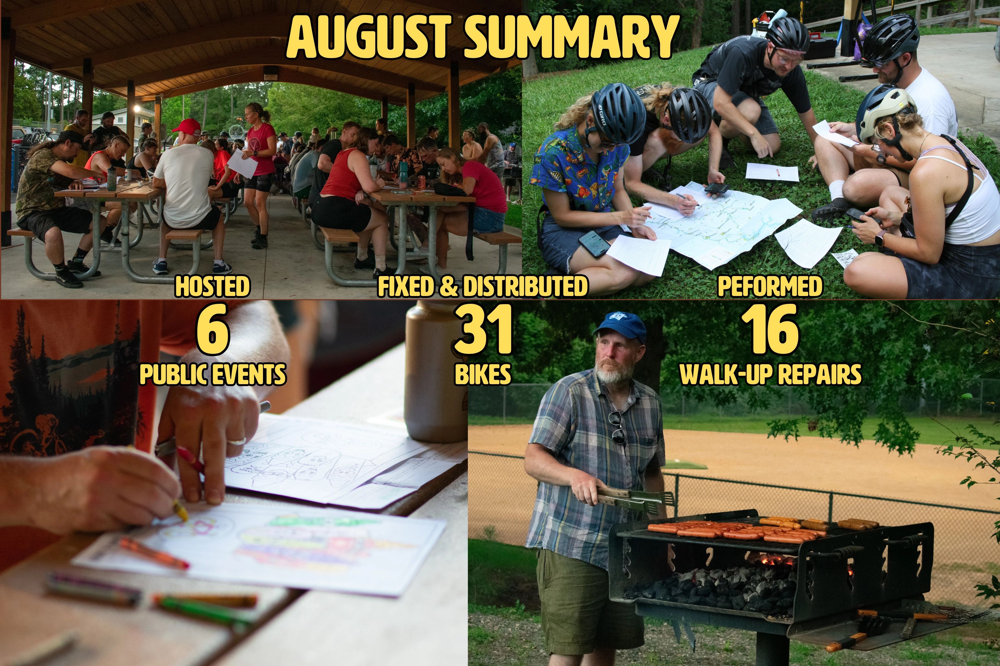
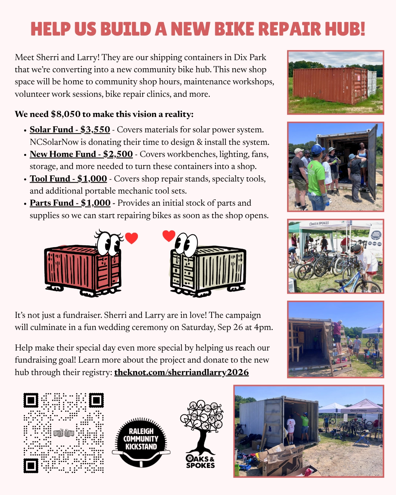
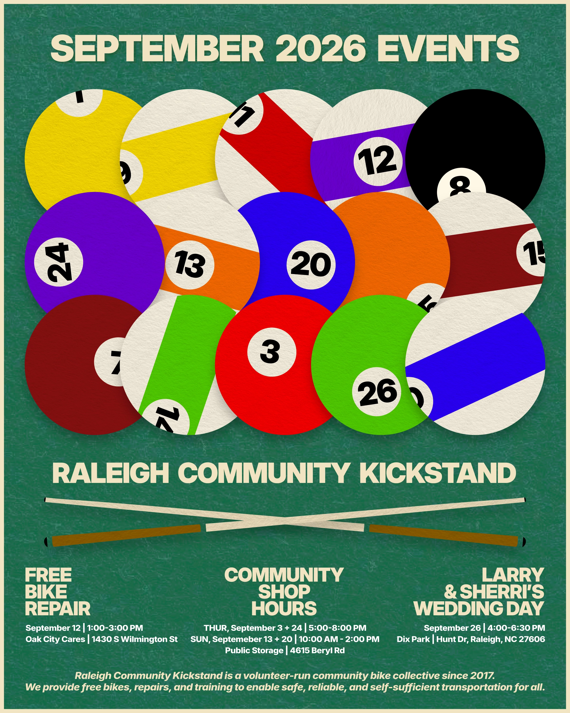

# September 2026 Newsletter

## Monthly Dispatch

Whew! August was a good one and a hot one. The Alleycat was a huge success. 76 riders came out to support what we do and have a good time. We raised over $500, rode a lot of miles, colored a lot, ate a lot of hot dogs, and donated 35 books to Prison Books Collective. Special shout out again to Sarah, Kat, Brandon, Brian, Chris, Ian, Kylie, Seth, Sydney, Dianne, and Christina for helping make it happen.

In other, more common news, we fixed a lot of bikes this month. We hosted 4 community shop hour sessions where a lot of folks came by to work on their bikes, learn about bike repair, and tune up some bikes for distribution. We also had our usual second Saturday repair event at Oak City Cares where we performed some walk-up repairs and refurbished a few bikes to give away.

All told, we performed 16 walk-up repairs and refurbished 31 bikes that we distributed through Oak City Cares, Salvation Army, Healing Transitions, Raleigh's House and Community Development Department, Feed the Pack Pantry, Raleigh Rescue Mission, and some direct mutual aid efforts.

## Container Fundraiser

As you’ve probably heard by now, we (Community Kickstand and Oaks & Spokes) have two shipping containers at Dix Park that we affectionately refer to as Sherri & Larry. We have kicked off a fundraiser to convert them into a proper community bike shop to serve as a future home for shop hours, volunteer work sessions, workshops, and other bike programming. Our goal is to raise $8,050 by the end of September for solar panels, workbenches, repair stands, tools, parts, lighting, ventilation, and storage.

We are billing it as a marriage between Sherri and Larry. The culmination of the event will be a fun wedding ceremony on Saturday, September 26th at 4pm. Learn more about the project and contribute if you can by donating through their registry: [theknot.com/sherriandlarry2026](https://theknot.com/sherriandlarry2026). Please share the image above or [this PDF](../media/fundraiser.pdf) with folks who would be interested in contributing.

## September Events

Flyer by Jared Harber

**Community Shop Hours \- everyone welcome\!**  
When: Thursdays, Sep 3 & 24, 5-8p | Sundays, Sep 13 & 20, 10a-2p  
Where: Public Storage \- 4615 Beryl Rd  
Our open shop hours at our storage space. Folks can come use our tools to learn about bike repair, work on their bike, and/or work on bikes for distribution. It’s a fun time working on bikes in good company. Contact [volunteer@raleighcommunitykickstand.org](mailto:volunteer@raleighcommunitykickstand.org) in advance for the gate access info.

**Bike Repair & Distribution \- volunteers needed\!**  
When: Saturday, September 12 | 1-3p  
Where: Oak City Cares \- 1430 S Wilmington Street  
We repair and distribute bikes on a first-come, first-served basis the 2nd Saturday of each month at Oak City Cares, a multiservice center for folks experiencing housing insecurity. We will have some tools and stands, but we often have more volunteers than stations, so feel free to bring your own. Please fill out the sheet below letting us know you are coming and how you’d like to help with the event.  
[https://docs.google.com/spreadsheets/d/1VJGkxpowGLi9LNfFjneI8mNoEKFTLBa6J27K8PHTpyE/edit?gid=302512647\#gid=302512647](https://docs.google.com/spreadsheets/d/1VJGkxpowGLi9LNfFjneI8mNoEKFTLBa6J27K8PHTpyE/edit?gid=302512647#gid=302512647)

**Sherri & Larry Wedding \- Container Fundraiser Party**  
When: Saturday, September 26 | 4-6:30p  
Where: Gravel Lot off Hunt Drive at Dix Park | 35.774059, \-78.660315  
Culmination of our fundraiser to outfit our two shipping containers in Dix Park. We need to raise $8,000 to outfit them with solar panels, workbenches, repair stands, tools, parts, lighting, ventilation, storage, and more. More details to be announced, but learn about the project and donate to the cause through their registry here: [theknot.com/sherriandlarry2026](http://theknot.com/sherriandlarry2026)
