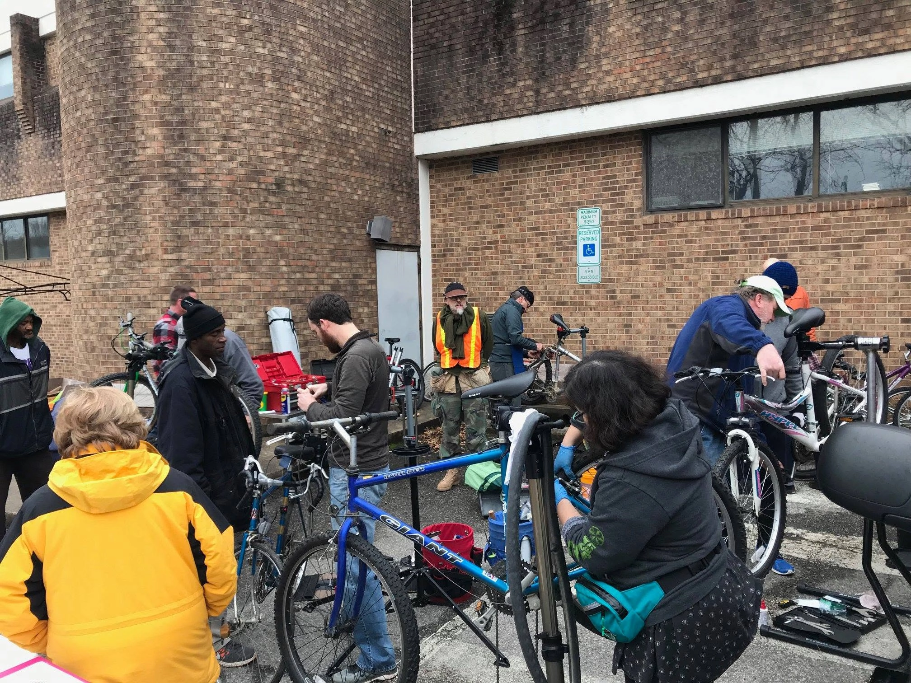
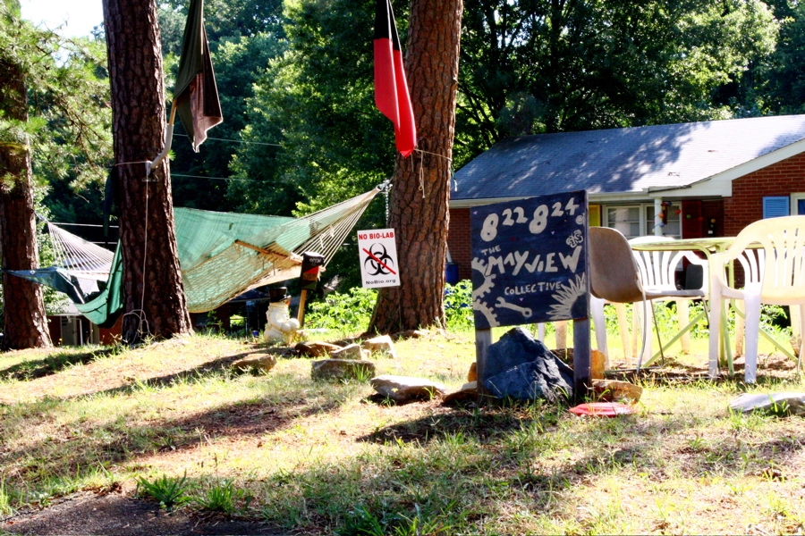
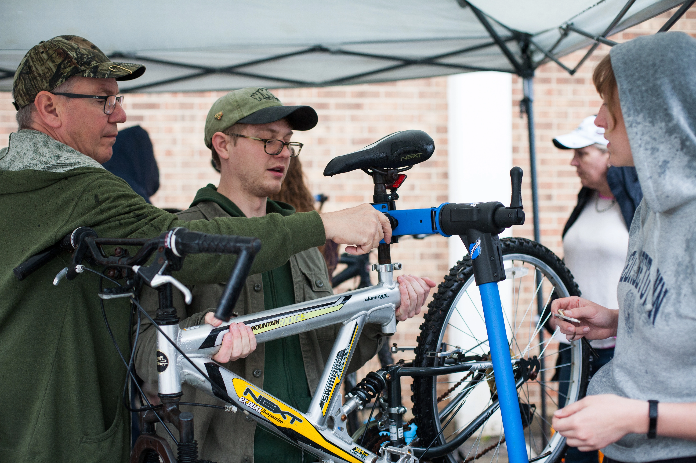
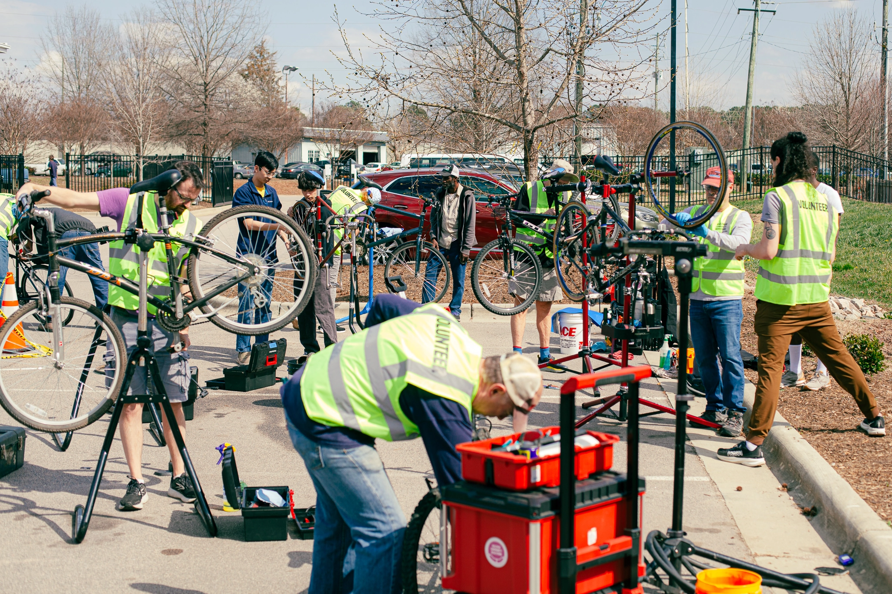
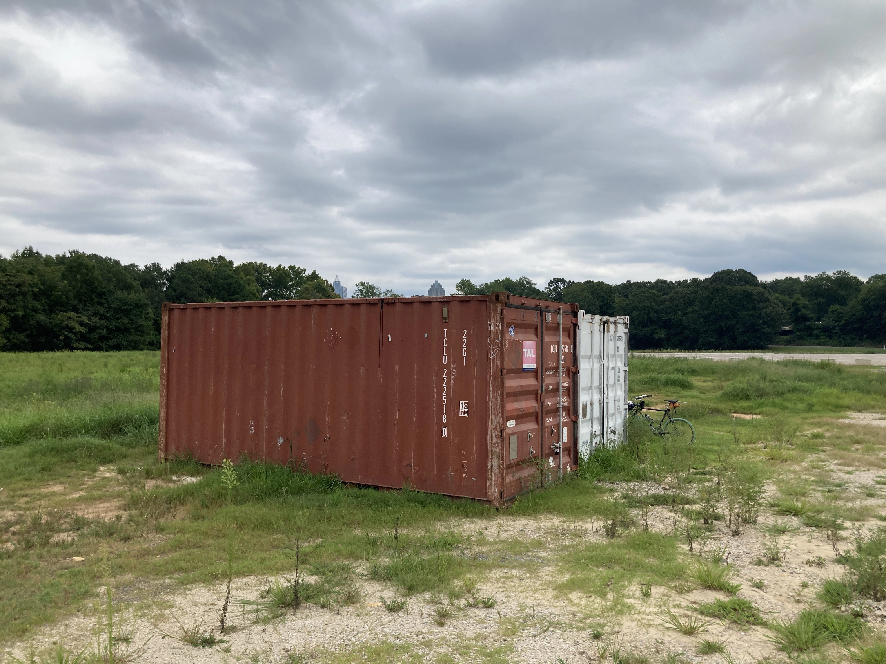
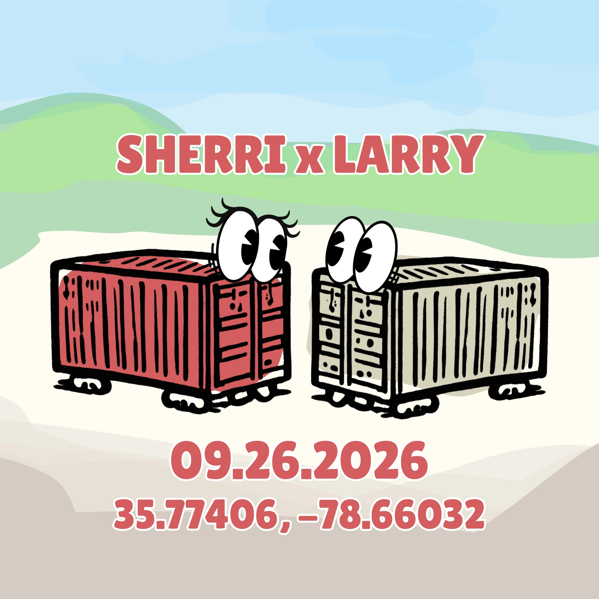
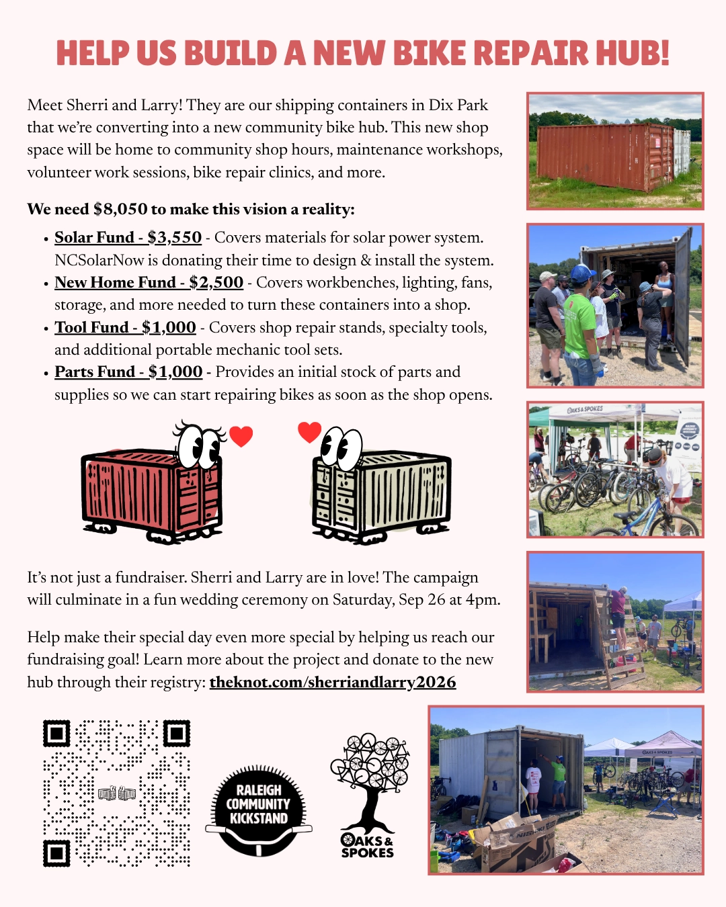

# Help us build a new bike hub in Raleigh!

## We've raised $5,000 of $8,000 so far, we still need your help!

Here's a special edition of our newsletter with a history lesson about Community Kickstand and an ask about the future.

If you already contribute a lot of your time to the co-op or you don't have the resources to donate, please share with folks who can contribute. If you can contribute or just want to learn more, read on and donate here: [theknot.com/sherriandlarry2026](http://theknot.com/sherriandlarry2026)

**Note**: We just updated our newsletters to use a Google group to more easily send them out and allow people to sign up and control their subscriptions themselves.

## How we got here

In 2017, a dozen of us sat around a table at Crank Arm Brewery and dreamt up a vision for a new bike co-op in Raleigh. It was an odd collection of folks from across the bike community brought together by Harry Rybacki of Oaks & Spokes and a common interest to see a new bike co-op in Raleigh.

1304 Bikes, Raleigh's original bike co-op, had been evicted from their place on Mayview Ave due to zoning issues eight years prior in 2009. They served the community since 2004 and without a proper space, were unable to continue forward. We find ourselves in a similar position.

Raleigh Community Kickstand was officially born in April 2017. It started with that initial crew of folks doing pop-up repair events once a month for those seeking hot meals and services at the Oak City Outreach Center in downtown Raleigh. We did this the second Saturday of each month from 1-3pm--an event we've been doing to this day for 114 months, now at the new center called Oak City Cares.

We started with a basic collection of our personal tools, flipping bikes upside down to work on them, and repacking hubs on top of trash can lids in a parking lot. And honestly, not too much has changed aside from the scale of the work we do. We have more tools, more knowledge, and more volunteers, but we are still fixing bikes in the middle of parking lots despite the weather and the temperature, all the while trying not to spill bearings all over the parking lot. I frequently joke that if I ever had the opportunity to work on a bike in air conditioning, I think I'd forget everything I ever knew. I dare someone to find us a space and challenge that notion.

Over the years, our scope has grown beyond just pop-up repair events. We began collecting bike donations, refurbishing them, and distributing them to folks experiencing housing insecurity and/or without reliable access to any other form of transportation. We now offer regular maintenance workshops and host community shop hours where people can come to our DIY shop space to use our tools to work on their bikes. To date, we've repaired 3,362 bikes, given away 2,371 bikes, and hosted 225 free public events.

This work would not be possible without our many volunteers, particularly John & Liz, who have devoted so much of their time and yard to this organization. We've also been supported by so many within the community including fellow bike organizations and mutual aid collectives, bike shops, and individuals who have donated their bikes, their time, and their money.

## Where we are headed

Which brings us to where we are now. We've been looking for a space to take this next step--to create a bike hub for bike repair and bike programming. For almost a decade, we've provided folks with the tools, resources, and knowledge to move freely and sustainably throughout their city through pop-up events. Now we want a place we can call home, where folks know they can find us. Where we can open the doors and welcome people in, without having to haul tools across the city and find someone to lend us a space.

We've identified that next step and we need your help to make it happen. We were given two shipping containers to convert into a new community bike shop in Dix Park, one from Trips for Kids RDU and one from a community member. The goal of this new space is to remove barriers to bike ownership and upkeep, but we need to raise $8,050 to make that happen.

Here is what we need to convert these containers into a usable community bike hub:

- **Solar Fund - $3,550** - Covers the materials for a solar power system. [NCSolarNow](https://ncsolarnow.com/) is generously donating their time and expertise to design and install the project.
- **New Home Fund - $2,500** - Covers the workbenches, storage, lighting, fans, and other infrastructure needed to turn these two containers into a functional bike shop.
- **Tool Fund - $1,000** - Rounds out our existing tool collection with shop repair stands, specialty tools, and additional portable mechanic tool sets.
- **Parts Fund - $1,000** - Provides an initial stock of parts and supplies so we can start repairing bikes as soon as the shop opens.

These containers, affectionately referred to as Sherri & Larry, will be a new home for Raleigh Community Kickstand and Oaks & Spokes. They will serve as a new home for all manner of bike programming including:

- **Community shop hours** - open hours for you to come use our tools and stands to work on bikes or learn to work on bikes
- **Bike repair clinics** - opportunities for community members who can't afford a tune-up to seek help maintaining their bikes
- **Volunteer work sessions** - events to refurbish donated bikes to give to folks without access to reliable transportation
- **Maintenance workshops** - formal classes to learn bike maintenance and repair
- And much more!

But to keep it characteristically weird, it's not just a fundraiser--it's a wedding. Sherri and Larry are in love! They are getting married in a fun ceremony in Dix Park on Saturday, Sep 26 at 4pm. The fundraiser is being run through the registry on their wedding website. Help us make this new chapter a reality and make Sherri and Larry's special day. Learn more about the project, donate to their registry, and RSVP for the wedding ceremony at [theknot.com/sherriandlarry2026](https://theknot.com/sherriandlarry2026).

Please share the image above or [this PDF](../media/fundraiser.pdf) with folks who would be interested in contributing.

These containers are the next step in our quest for a more permanent home for bike repair and education in Raleigh. A place where we can host regular hours and easily roll up the doors and welcome people in. If you know of opportunities and/or are interested in helping us provide a public space to support mobility independence for all, please contact [info@raleighcommunitykickstand.org](mailto:info@raleighcommunitykickstand.org).
