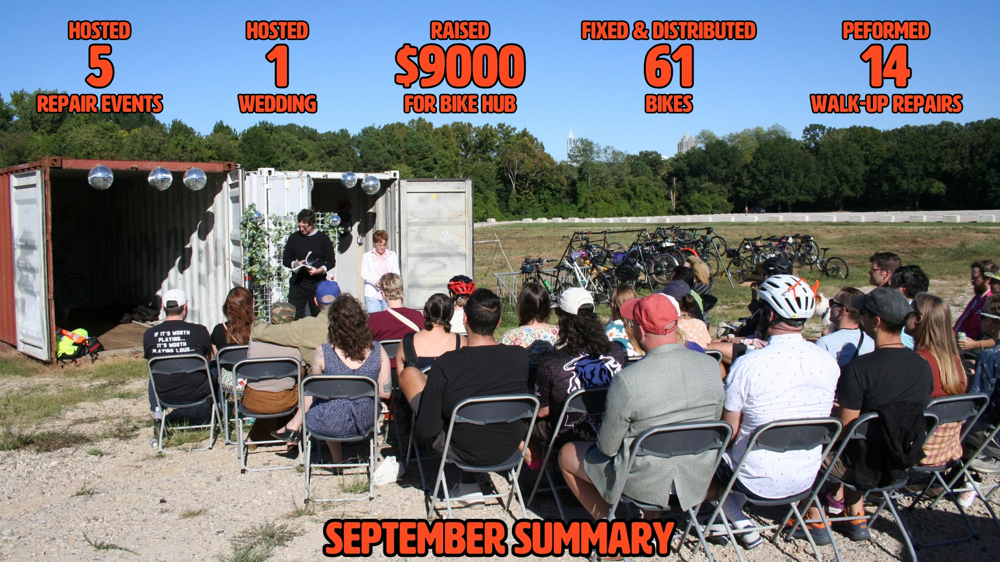

# October 2026 Newsletter

## Monthly Dispatch

September was a huge month for us\! Not only were we up to our usual shenanigans hosting community shop hours and our second Saturday, we also found the time to run a fundraiser and host our very first wedding\! Over the course of the month, we performed 14 walk-up repairs at our wettest Oak City Cares event ever and our four community shop hour sessions. Our adopt-a-bike volunteers and shop hour volunteers refurbished another 61 bikes to distribute to our partner organizations, which this month included Neighbor to Neighbor, HOST NC, Durham Rescue Mission, Wake Tech Student Services, Durham Community Food Pantry, and some direct mutual aid efforts.

The fundraiser to outfit our (Community Kickstand and Oaks & Spokes) two shipping containers in Dix Park was a huge success\! We met our fundraising goal and will be starting our efforts this month to convert them into a new bike repair and education hub in the center of Raleigh. NCSolarNow will begin installing the solar panel system this week, and we will continue to chip away at our honey-do list in the coming months for the newlyweds Sherri & Larry. Our hope is to have this space up and running as the new home of shop hours and other events at the start of next year.

Thanks so much to everyone who supported the fundraiser and came out to the wedding to celebrate the success in style. It is a very bizarre experience to see a really goofy idea come to life and exist outside your head, let alone have 50 people in attendance. So many people came together to make the campaign and the ceremony a success. I want to thank our officiant Kylie, our reader Michael Dunn, our sermon-giver Jared, our flower people Jesse & Caroline, our musical guest Nick, Marisa who baked the cakes, Brian H. who made the bouquet out of bike parts, Brian L. who made the spoke cards, Jared who made the rings, Amber who made the pins, and Sarah U. who contributed decorations. I would also like to thank Dix Park for their support and the many people who helped behind the scenes including Kylie, Jared, Kat, Sadie, and Sarah A. It really was the community coming together and we are very excited about the future of Sherri and Larry\!

## Call For Help

_Note from the volunteer coordinator / coordinator coordinator:_

Before I enumerate some explicit calls for help, I want to reiterate that you are Community Kickstand\! Community Kickstand is not any one person or a board of individuals in a stuffy room; it truly is a collective composed of many people who contribute in the ways they can. All that to say, if you want to get more involved and drive it in a specific direction, you can\! If you want to host a repair event or community shop hours or a volunteer work session, you can\! Anyone is welcome to propose events and I will get them up on the calendar and in this email.

With that being said, I will need some help with Kickstand things in the coming months. I am typically the person who transports equipment to and from the repair events and helps run community shop hours. I got hit by a car while biking into work last week and will be out of commission for a bit. I should be okay in the long run, but I have a good bit of damage in my lower right leg that will require surgery and prevent me from walking or driving for at least the next three months. So now is a great time to step up and run events\!

With that being said, here are my concrete asks for now:

- Can 1 or 2 people transport tools and repair stands to and from Oak City Cares on Saturday, October 10?
- Can anyone assist Jared & Kylie with Community Shop Hours on October 11 and 25?
- Is anyone interested in helping coordinate a workshop / repair event with Peach Road Park the week of Nov 16th?
- Moving forward, please let me know if you’re interested in helping behind the scenes or coordinate events for November and beyond\!

We are probably due for another meeting before the end of the year. I will be targeting sometime in November so keep an eye out for that probably in the next newsletter. Thanks\!  
\- Michael D’Argenio

## October Events

**Community Shop Hours \- everyone welcome\!**  
When: Sundays, October 11 & 25, 10a-2p  
Where: Public Storage \- 4615 Beryl Rd  
Our open shop hours at our storage space. Folks can come use our tools to learn about bike repair, work on their bike, and/or work on bikes for distribution. It’s a fun time working on bikes in good company. Contact [volunteer@raleighcommunitykickstand.org](mailto:volunteer@raleighcommunitykickstand.org) in advance for the gate access info.

**Bike Repair & Distribution \- volunteers needed\!**  
When: Saturday, October 10 | 1-3p  
Where: Oak City Cares \- 1430 S Wilmington Street  
We repair and distribute bikes on a first-come, first-served basis the 2nd Saturday of each month at Oak City Cares, a multipservice center for folks experiencing housing insecurity. We will have some tools and stands, but we often have more volunteers than stations, so feel free to bring your own. Please fill out the sheet below letting us know you are coming and how you’d like to help with the event.  
[https\://docs.google.com/spreadsheets/d/1VJGkxpowGLi9LNfFjneI8mNoEKFTLBa6J27K8PHTpyE/edit?gid=302512647\#gid=302512647](https://docs.google.com/spreadsheets/d/1VJGkxpowGLi9LNfFjneI8mNoEKFTLBa6J27K8PHTpyE/edit?gid=302512647#gid=302512647)

**Dix Chapel Biketober Workshop Series with Oaks & Spokes**  
When: Thursdays in October 5:30-7:30pm  
Where: Greg Poole, Jr. All Faiths Chapel \- 1030 Richardson Dr  
More information and sign-ups at each of the links below:

- October 1 5:30-7:30pm -
  [Workshop \#1 Learn to fix your bike (open to all)](https://www.eventbrite.com/e/learn-to-fix-your-bike-beginner-tickets-1994957986039)
- October 8 5:30-7:30pm - [Workshop \#2 Learn to fix your bike (reserved for women)](https://www.eventbrite.com/e/learn-to-fix-your-bike-beginner-for-women-tickets-1994972915694)
- October 22 5:30-7:30pm -
  [Workshop \#3 Bike Commuting 101: Route Planning and Wayfinding](https://www.eventbrite.com/e/bike-commuting-101-route-planning-and-wayfinding-tickets-1994976909640)
- October 29 5:30-7:30pm -
  [Workshop \#4 Bike Commuting 201: Don't Pollute the Commute](https://www.eventbrite.com/e/bike-commuting-201-dont-pollute-the-commute-tickets-1994982753118)
